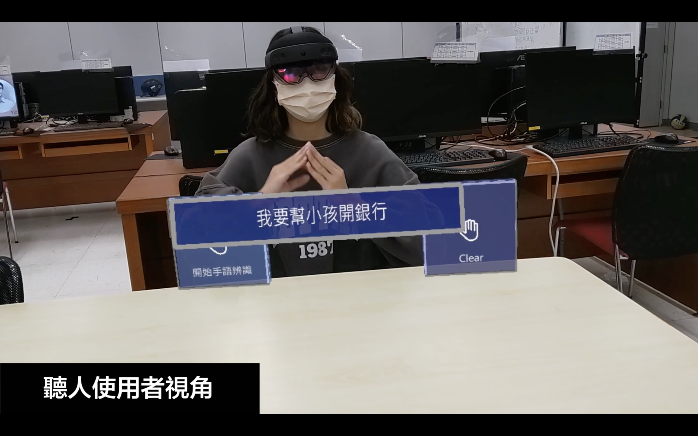

# SignLens  
  
## NCCU MIS 108 Graduation Project  
According to the statistics from the Department of Statistics of the Ministry of Health and Welfare in 2021, the hearing-impaired population in Taiwan accounts for approximately 10.5% of the disabled population, meaning one out of every ten disabled people in Taiwan is hearing impaired. Most hearing-impaired individuals rely on hearing aids, lip-reading, and sign language to receive external information. However, hearing aids are ineffective in noisy environments, and the COVID-19 pandemic has made it more difficult for hearing-impaired individuals to receive information through lip-reading due to the use of masks. Moreover, Taiwanese society has a general lack of knowledge about sign language. Therefore, improving bidirectional communication between people with hearing impairment and those without it has become more important.  

We uses Taiwan Sign Language as the application languages and employs the HoloLens2 head-mounted display in a mixed-reality environment to provide accessible bidirectional communication between hearing-impaired individuals and those with normal hearing in common banking scenarios.  The system enhances bidirectional communication between hearing-impaired individuals and those with normal hearing, reducing communication costs and burdens for both parties.  

We hope this project can integrate technology and practical applications, improve the quality and convenience of communication between hearing-impaired individuals and those with normal hearing in daily life, and raise awareness of the needs of the disabled community among the public.  

## Speech Recognition  

We utilizes a "speech recognition system" to convert the speech of those with normal hearing into text, which is displayed on the screen of the hearing-impaired individual, allowing them to understand the content even in noisy environments or situations where they cannot recognize lip-reading. 
- Azure Cognitive Services  
  

## Sign Language Recognition  

At the same time, the "sign language recognition system" converts sign language and facial expressions into text and displays the text on the screen of those with normal hearing, enabling them to understand the meaning even if they cannot understand sign language.  
- Machine Learning
- Mediapipe + Tensorflow (LSTM)  
  

## Mixed Reality
- HoloLens 2
