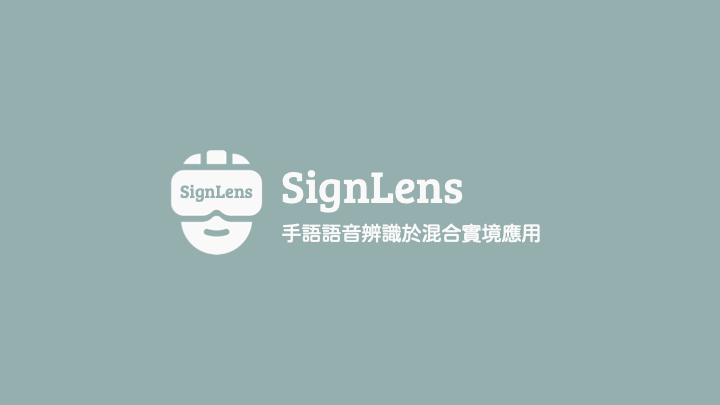

# SignLens
NCCU MIS 108 Graduation Project

## Sign Language Recognition
- Machine Learning
- Mediapipe + Tensorflow (LSTM)

## Voice Recognition
- Azure Cognitive Services

## Mixed Reality
- HoloLens 2
